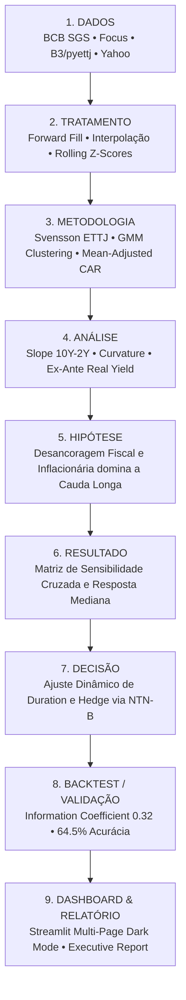

# 🇧🇷 Brazilian Rates Intelligence (BRI)

[](https://www.python.org/downloads/)
[](https://streamlit.io/)
[](https://plotly.com/)
[](https://opensource.org/licenses/MIT)
[](https://docs.pytest.org/)

> **A quantitative framework for understanding the Brazilian yield curve.**  
> *"Como mudanças nas expectativas de inflação, política monetária e risco fiscal se propagam pela curva de juros brasileira e pelos principais ativos?"*

---

## 📌 Visão Geral

O **Brazilian Rates Intelligence (BRI)** é uma plataforma analítica e quantitativa desenvolvida para mesas de **CIB, Asset Management e Macro Hedge Funds**. O sistema decompõe a Estrutura a Termo da Taxa de Juros (ETTJ) brasileira, identifica regimes macroeconômicos com aprendizado não supervisionado, quantifica choques exógenos via *event studies* clássicos e sintetiza a pressão direcional da curva através do **Rates Pressure Score**.

---

## 🏛️ Pipeline Quantitativo

O projeto implementa a arquitetura de 9 estágios para análise quantitativa institucional:



---

## 📊 Módulos do Dashboard (6 Páginas)

O dashboard interativo em Streamlit é construído com design dark mode profissional e paleta CIB:

| Página | Pergunta Central | Conteúdo & Modelos |
| :--- | :--- | :--- |
| **1. Macro Overview** | *"O que está acontecendo?"* | Selic, IPCA 12m, Dívida/PIB, PTAX, Focus e matriz de correlações macro. |
| **2. Yield Curve** | *"O que a curva está precificando?"* | Curvas históricas vs atual, evolução de Slope (10Y-2Y), Curvature (borboleta) e Real Yield ex-ante. |
| **3. Market Regimes** | *"Em qual regime estamos?"* | Classificação em 4 regimes (Risk-on, Risk-off, Inflacionário, Desinflacionário) com validação GMM. |
| **4. Event Studies** | *"Como o mercado reagiu historicamente?"* | Retorno Anormal Acumulado (CAR) em janelas [-5, +20] para decisões de COPOM, FOMC e choques fiscais. |
| **5. Asset Impact** | *"O que isso significa para os ativos?"* | Simulador de choques na curva (±50bps, ±100bps, ±200bps) e sensibilidade de Ibovespa, IFIX, USD e IMAB11. |
| **6. Rates Signal** | *"Há pressão de alta ou alívio nos juros?"* | Gauge do Rates Pressure Score (-100 a +100), decomposição dos 4 pilares e métricas de backtest (IC e hit rate). |

---

## 📐 Formulações Matemáticas e Econométricas

### 1. Métricas da Curva de Juros
- **Nível ($L_t$)**: $L_t = \frac{y_{t, 2Y} + y_{t, 5Y} + y_{t, 10Y}}{3}$
- **Inclinação ($S_t$)**: $S_t = y_{t, 10Y} - y_{t, 2Y}$
- **Curvatura ($C_t$)**: $C_t = 2 \cdot y_{t, 5Y} - y_{t, 2Y} - y_{t, 10Y}$
- **Juro Real Ex-Ante**: $r^{\text{real}}_{t, 10Y} = y_{t, 10Y} - \mathbb{E}_t[\pi_{12m}^{\text{Focus}}]$

### 2. Event Study Econométrico
- Retorno Normal via modelo de média na janela de estimação $[-120, -21]$:
$$\mu_{i} = \frac{1}{100} \sum_{t=-120}^{-21} R_{i, t}$$
- Retorno Anormal e Retorno Anormal Acumulado:
$$AR_{i, t} = R_{i, t} - \mu_{i}, \quad CAR_i(t_1, t_2) = \sum_{t=t_1}^{t_2} AR_{i, t}$$

### 3. Rates Pressure Score (Modelo Multifatorial)
$$Composite\_Z_t = 0.30 \cdot Z^{\text{Inflação}}_t + 0.20 \cdot Z^{\text{Fiscal}}_t + 0.25 \cdot Z^{\text{Câmbio}}_t + 0.25 \cdot Z^{\text{Monetário}}_t$$
$$RPS_t = 100 \cdot \tanh\left(\frac{Composite\_Z_t}{2}\right) \in [-100, +100]$$

---

## 🗂️ Estrutura do Repositório

```
Brazilian Rates Intelligence/
├── README.md                          # Documentação institucional do projeto
├── requirements.txt                   # Dependências Python
├── setup.py                           # Empacotamento
├── config/
│   ├── settings.py                    # Constantes de modelagem, pesos e janelas
│   └── series_codes.py                # Catálogo de códigos SGS, Focus e Yahoo tickers
├── data/
│   ├── raw/                           # Cache local de dados brutos
│   ├── processed/                     # Dados tratados alinhados
│   └── events/                        # Tabelas curadas de eventos (COPOM, FOMC, Fiscal)
├── src/
│   ├── collectors/                    # Módulo de Coleta
│   │   ├── bcb_collector.py           # SGS e Focus API
│   │   ├── market_collector.py        # Yahoo Finance (Ibovespa, IFIX, USD, IMAB11)
│   │   ├── curve_collector.py         # ETTJ e vértices via pyettj
│   │   └── events_collector.py        # Eventos econômicos e surpresas
│   ├── processors/                    # Módulo de Tratamento
│   │   ├── macro_processor.py         # Alinhamento temporal e normalização z-score
│   │   ├── curve_processor.py         # Cálculo de Slope, Curvature e Real Yield
│   │   └── returns_processor.py       # Retornos, volatilidade realizada e drawdowns
│   ├── analytics/                     # Módulo Analítico & Quantitativo
│   │   ├── regime_classifier.py       # Regimes de mercado e validação GMM
│   │   ├── event_study.py             # Framework de Event Study e significância t-stat
│   │   ├── asset_impact.py            # Sensibilidade cruzada e lead/lag
│   │   └── rates_signal.py            # Rates Pressure Score e backtest
│   └── utils/
│       └── cache.py                   # Sistema de cache com TTL
├── dashboard/
│   ├── app.py                         # Ponto de entrada do Streamlit
│   ├── pages/                         # As 6 páginas analíticas
│   └── components/                    # CSS, tema dark mode, sidebar e KPI cards
├── reports/
│   └── executive_report.md            # Relatório executivo completo (~10 páginas)
└── tests/                             # Suíte de testes unitários
    ├── test_collectors.py
    ├── test_processors.py
    └── test_analytics.py
```

---

## 🚀 Como Executar

### 1. Clonar o repositório e preparar o ambiente
```bash
git clone https://github.com/seu-usuario/brazilian-rates-intelligence.git
cd "Brazilian Rates Intelligence"

python -m venv .venv
# No Windows:
.venv\Scripts\activate
# No Linux/Mac:
source .venv/bin/activate

pip install -r requirements.txt
```

### 2. Rodar a suíte de testes unitários
```bash
pytest tests/ -v
```

### 3. Iniciar o Dashboard Interativo
```bash
streamlit run dashboard/app.py
```
O dashboard abrirá automaticamente no navegador em `http://localhost:8501`.

---

## 📑 Relatório Executivo
O relatório quantitativo institucional completo está disponível em [`reports/executive_report.md`](reports/executive_report.md).

---

## ⚖️ Licença e Disclaimer
Distribuído sob a licença MIT. Consulte `LICENSE` para obter mais detalhes.  
*Aviso*: Este software é destinado exclusivamente para fins de pesquisa quantitativa e educacional. Não constitui consultoria financeira ou recomendação de investimento.
